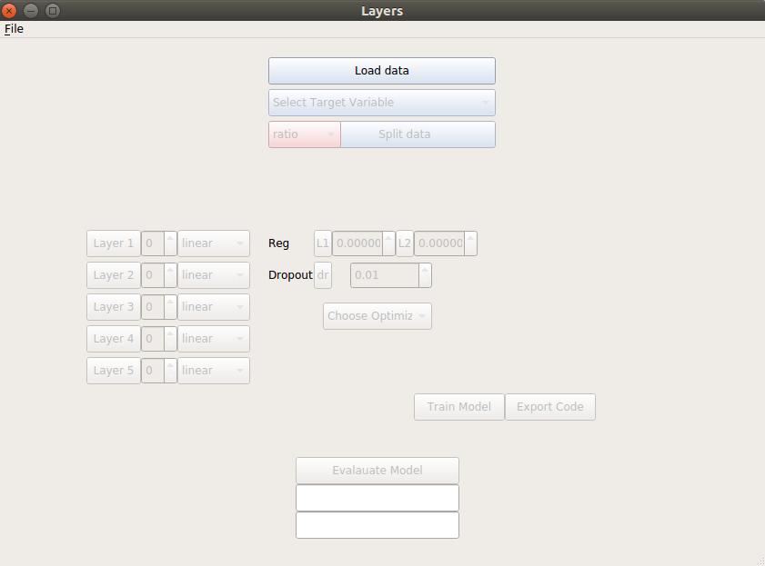
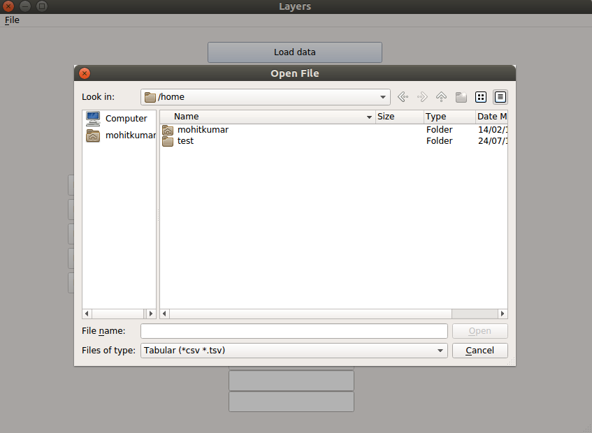
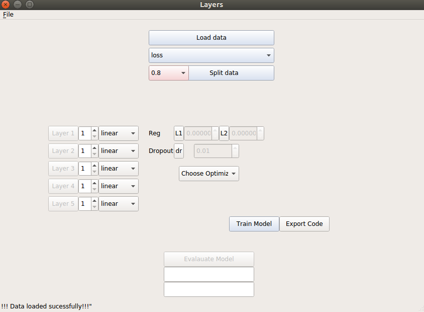
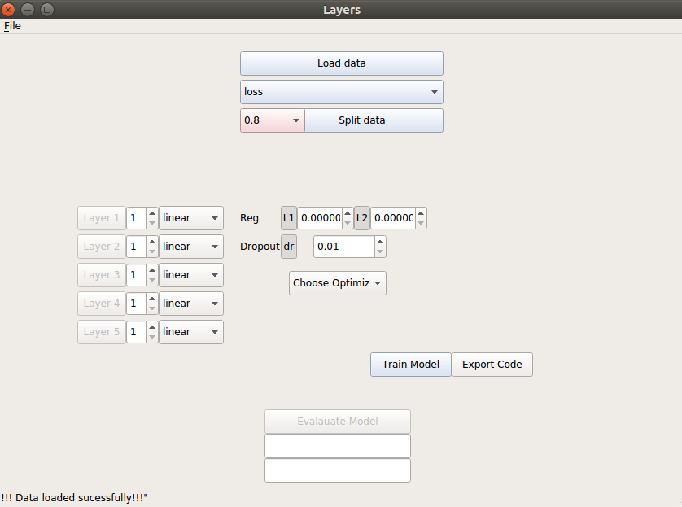
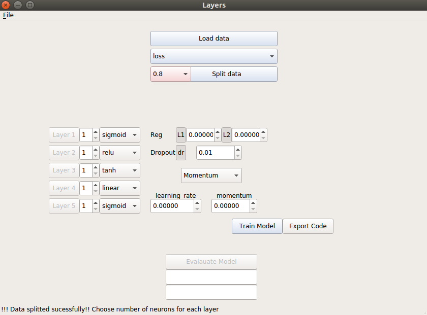
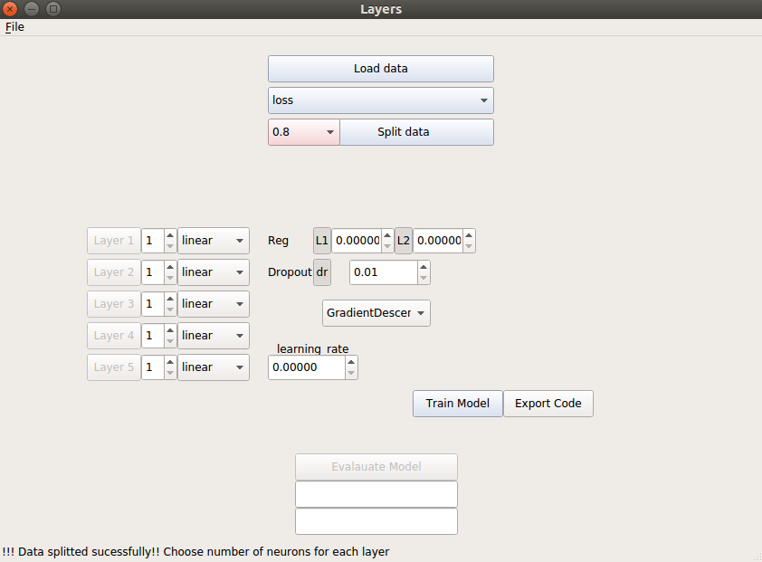
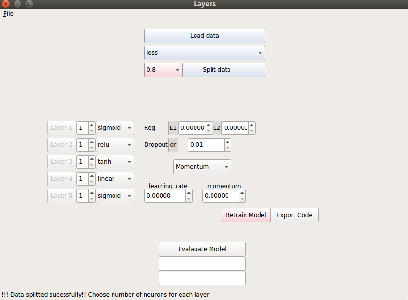

# README #

This README would normally document whatever steps are necessary to get your application up and running.

### What is this repository for? ###

* A simple GUI based application for 
* applying machine learning alorithms
* Currently supports classification 
* problems with tsv/csv formats. 
* v0.01

### How do I get set up? ###
Enviroment setup:
	- Download and install [Annaconda](https://www.anaconda.com/download/)
	- create a virtual enviroment (**conta create -n gui python=3.6**)
	- activate it using (**source activate gui**)
	- Install required packages using (**pip install requirements.txt**)	

**RUN**: python neunet.py

**Dependencies** : tensorflow, pandas, scikit-learn

## Sneak peak GUI ##

* Init 

* Load Dialog

* Split Data

* Toggle Switches

* Activation Functions

* Optimizer

* Training Done

### Contribution guidelines ###
**Contains lots of bugs. Create an issue and helps in development of project. I would love to fix them.**

* Writing tests
* Code review
* Other guidelines

### Who do I talk to? ###

* Mohit Kumar : https://github.com/minto4644

